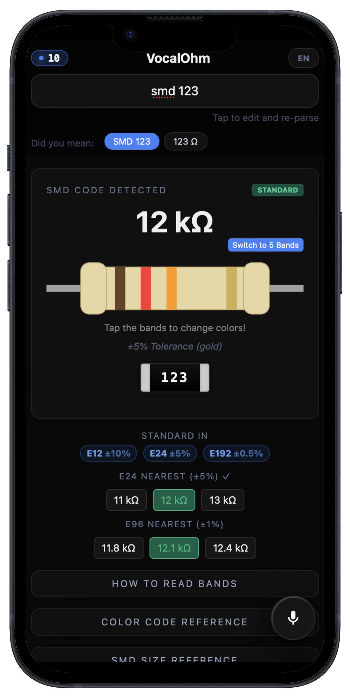
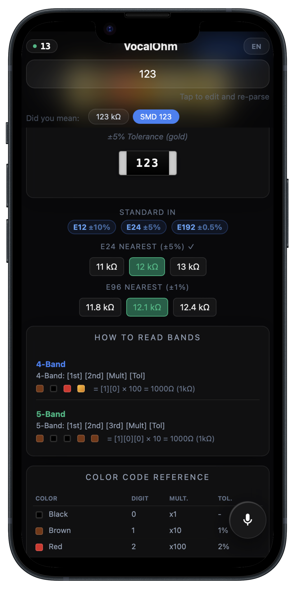

# [🎙️ VocalOhm — Voice-Controlled Resistor Calculator](https://noname122021.github.io/vocalohm/)

  

**VocalOhm** is a modern, web-based tool designed for electronics hobbyists and professionals. It allows you to identify resistor values, decode color bands, and calculate parallel resistance using simple voice commands.

### 🔗 [Try VocalOhm Live](https://noname122021.github.io/vocalohm/)

  
  &nbsp;&nbsp;&nbsp;&nbsp;
  

---

## ✨ Key Features

-   **🎙️ Voice-First Interaction**: Just tap and say "4.7k", "Red Red Brown", or "SMD 103".
-   **🎨 Color Band Decoder**: Supports 4, 5, and 6-band resistors with interactive visual editing.
-   **📱 SMD Code Interpretation**: Decodes 3-digit, 4-digit, and EIA-96 codes instantly.
-   **⚡ Parallel Calculator**: Easily calculate equivalent resistance for multiple resistors (e.g., "parallel 10k and 10k").
-   **📚 Built-in Reference**: High-speed lookup for standard E-Series (E24, E96, E192) and SMD sizes.
-   **🔌 100% Offline & Private**: Works entirely on your device with no cookies, no tracking, and no internet required.
-   **🚀 Lightning Fast**: Incredibly small size (~30KB gzipped) that loads in a fraction of a second even on slow connections.
-   **🌐 Multi-language Support**: Fully localized in English and Russian.